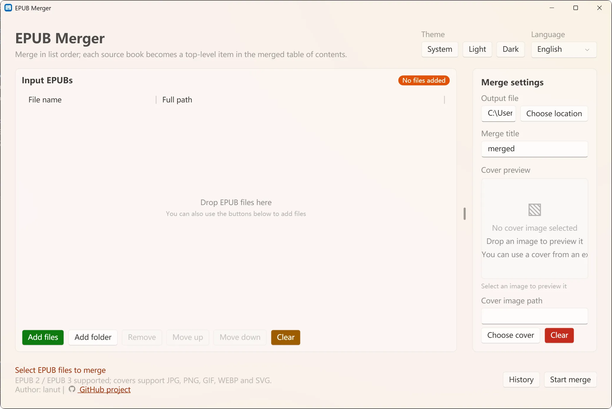
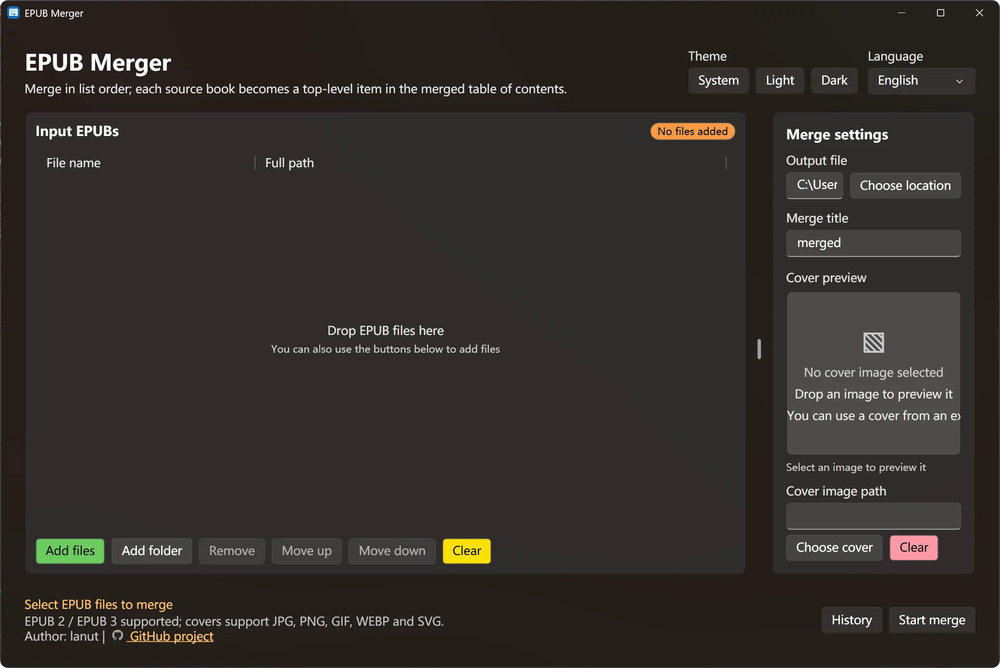
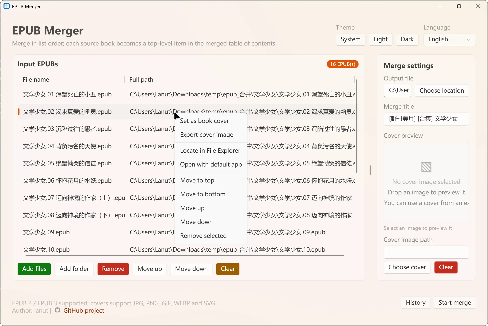

# EPUB Merger

[中文文档](README.md)

A simple Windows desktop EPUB merger built with WPF and .NET 10. It combines multiple EPUB files into a single EPUB 3 file in the specified order, while keeping each source book as a top-level item in the merged contents. The application supports drag-and-drop ordering, custom titles and output paths, cover preview, bilingual UI, and system, light, and dark themes.

## Screenshots

### Light theme (empty state)



### Dark theme (empty state)



### Application in use



## Features

- Add multiple EPUB files and reorder them by drag and drop or buttons
- Remove selected files or clear the list
- Support EPUB 2 and EPUB 3 input files
- Keep each source book as a top-level item in the merged contents
- Customize the output file path and merged title
- Select or drop a cover image and preview it
- Extract and export a cover image from a source EPUB
- Import EPUB files from folders, including recursive subfolder scanning
- Sort inputs naturally, by name, or keep the original order
- Restore recent tasks
- Cancel a merge while it is running
- Open the output file or its containing folder after a successful merge
- Support JPG, JPEG, PNG, GIF, WEBP, and SVG covers
- Switch between system, light, and dark themes
- Switch the interface between Chinese and English at runtime
- Display localized merge and cover-reading errors while recording detailed logs for troubleshooting
- Show merge progress and synchronize it with the taskbar progress indicator
- Automatically generate the EPUB 3 container, navigation page, and table of contents
- Handle duplicate resource names to prevent files from being overwritten

## Usage

1. Start the application.
2. Click **Add Files**, or drag EPUB files into the list on the left.
3. Select files and use **Move Up** or **Move Down** to adjust the merge order.
4. Set the output file, merged title, and optional cover image on the right.
5. Click **Start Merge**.
6. Wait for the status bar to report completion, then find the generated EPUB file at the configured output location.

The output file must use the `.epub` extension and must not overwrite an input file.

## CLI mode

The published GUI executable also supports command-line mode without creating a window. Use `--cli` or `-c` to enter CLI mode:

```powershell
EpubMerge.Gui.exe --cli -i .\vol*.epub -o .\merged.epub --title "Collection"
EpubMerge.Gui.exe -c -d .\books -r -o .\merged.epub --sort natural
EpubMerge.Gui.exe --cli -i .\one.epub .\two.epub -o .\merged.epub --cover-from-index 1
```

Common options:

- `-i`/`--input`: input EPUB files, wildcards, or a list of paths
- `-d`/`--directory`: scan a directory; use `-r`/`--recursive` to scan subdirectories
- `-o`/`--output`: output EPUB path (required)
- `--cover`: specify an external cover image, or use `--cover-from-index N` to select an embedded cover from the Nth book
- `--sort natural|name|none`: natural sort, name sort, or preserve input order
- `-q`/`--quiet`, `-v`/`--verbose`: control log output
- `-h`/`--help`, `--version`: display help or version information

CLI exit codes are `0` (success), `1` (argument or input validation failure), and `2` (runtime error or cancellation).

## Requirements

- Windows
- .NET 10 Desktop Runtime

## Build

Run the following commands from the repository root:

```powershell
dotnet restore EpubMerge.slnx
dotnet build EpubMerge.slnx
dotnet test EpubMerge.slnx
```

Run the GUI project:

```powershell
dotnet run --project src/EpubMerge.Gui/EpubMerge.Gui.csproj
```

## GitHub Actions release

The repository includes a GitHub Actions workflow. Pushing to `master` or opening a pull request automatically restores dependencies, builds the project, and runs the tests.

To publish a release, create and push a tag beginning with `V`, for example:

```powershell
git tag V1.0.0
git push origin V1.0.0
```

The workflow creates four archives on a Windows runner: self-contained and framework-dependent packages for both `win-x64` and `win-arm64`. Framework-dependent packages require the .NET 10 Desktop Runtime on the target machine.

## Project structure

```text
src/
  EpubMerge.Core.Pure/  EPUB validation and merge logic
  EpubMerge.Gui/        WPF graphical interface
tests/
  EpubMerge.Core.Tests/ Core logic tests
  EpubMerge.Gui.Tests/  ViewModel tests
readmeRef/              README screenshots
```

## Notes

- The merged result is an EPUB 3 container with regenerated navigation and table-of-contents information.
- Encrypted or font-obfuscated EPUB files containing `META-INF/encryption.xml` are not currently supported.
- Source files are read only; the application does not modify the original EPUB files.

## License

This project is licensed under the terms in [LICENSE](LICENSE).