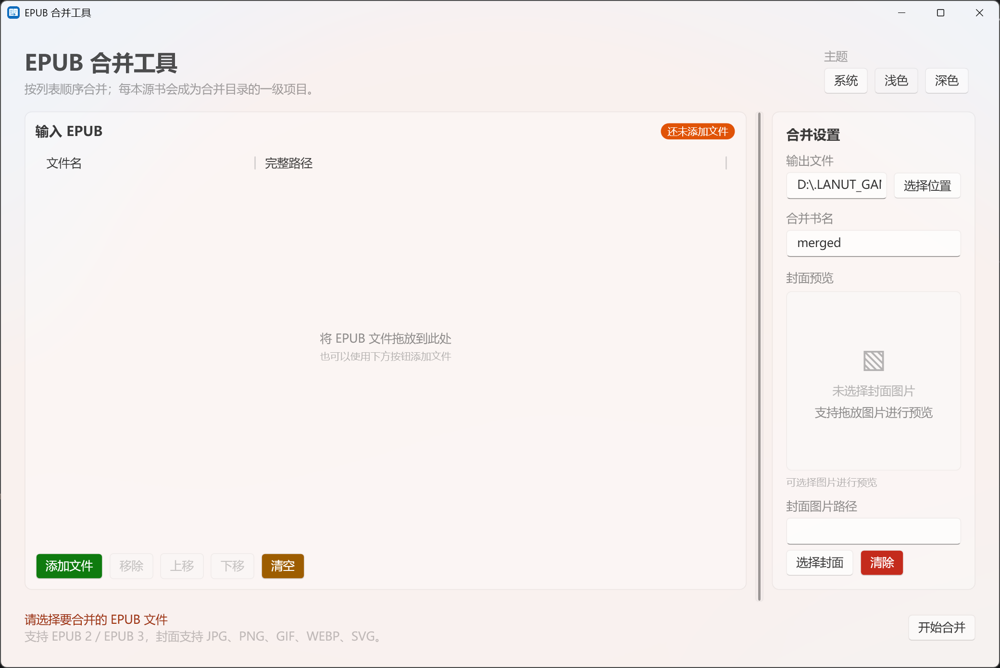
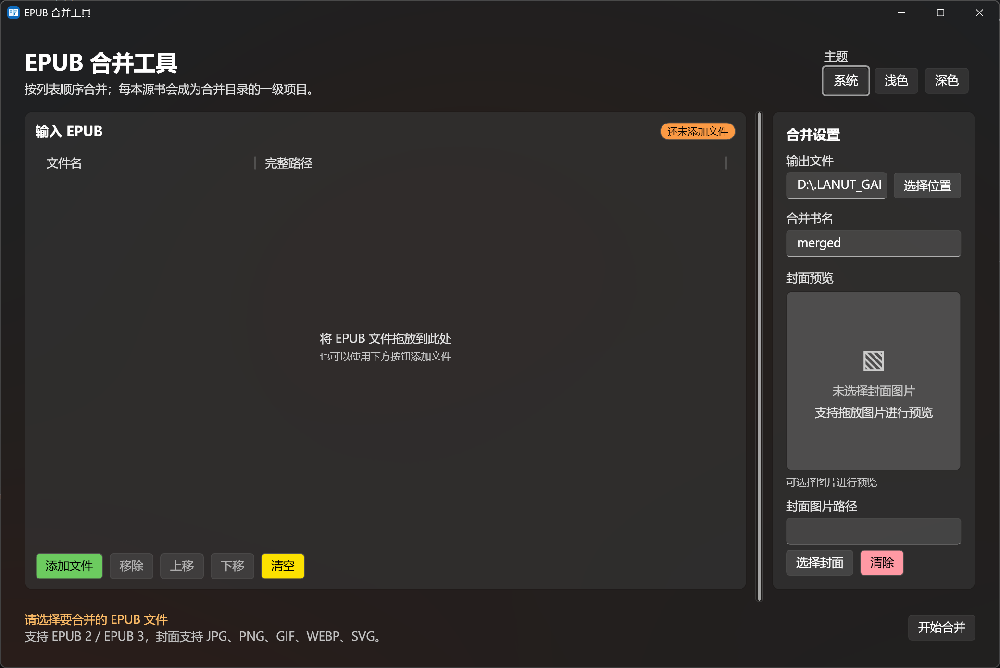
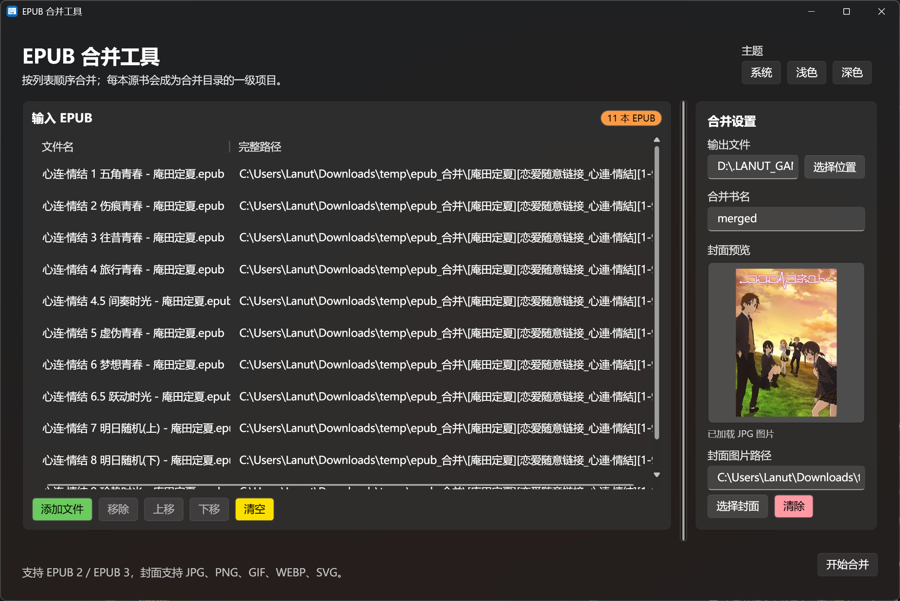

# EPUB 合并工具

[English](README.en.md)

一个简洁的 Windows EPUB 合并桌面工具，基于 WPF 和 .NET 10 构建。它可以将多本 EPUB 按指定顺序合并为一个 EPUB 3 文件，并保留每本源书作为合并目录中的一级项目。应用支持拖放排序、自定义书名与输出路径、封面预览，以及系统、浅色和深色主题，适合整理连载小说、系列电子书和分卷内容。

## 界面预览

### 浅色主题（空白状态）



### 深色主题（空白状态）



### 使用中的应用界面



## 功能特性

- 支持添加多本 EPUB，并通过拖放或按钮调整顺序
- 支持移除选中文件、清空列表
- 支持 EPUB 2 / EPUB 3 输入
- 将每本源书保留为合并目录中的一级项目
- 支持自定义输出文件路径和合并书名
- 支持选择或拖放封面图片，并提供封面预览
- 支持从源 EPUB 提取、导出封面图片
- 支持文件夹批量导入、自然排序和最近任务恢复
- 合并过程中可取消任务，完成后可直接打开文件或所在文件夹
- 支持命令行模式，可进行批量合并和自动化处理
- 支持中英文界面运行时切换
- 合并失败和封面读取错误提供本地化提示，并记录详细日志便于排查
- 支持 JPG、JPEG、PNG、GIF、WEBP、SVG 封面
- 支持系统、浅色和深色主题
- 合并过程中显示进度，并同步显示任务栏进度
- 自动生成 EPUB 3 容器、导航页和目录信息
- 对重复资源名称进行处理，避免合并时发生覆盖

## 使用方法

1. 启动应用。
2. 点击“添加文件”，或将 EPUB 文件拖入左侧列表。
3. 按需要选择文件并使用“上移”“下移”调整合并顺序。
4. 在右侧设置输出文件、合并书名和可选的封面图片。
5. 点击“开始合并”。
6. 等待状态栏显示合并完成，并在设置的输出位置找到生成的 EPUB 文件。

输出文件必须使用 `.epub` 扩展名，且不能覆盖输入文件。

## CLI 命令行模式

发布包中的 CLI 程序独立于 GUI，不会创建窗口。GUI 和 CLI 位于同一个架构/部署模式目录中：

```powershell
EpubMerge.Cli.exe -i .\vol*.epub -o .\merged.epub --title "合辑"
EpubMerge.Cli.exe -d .\books -r -o .\merged.epub --sort natural
EpubMerge.Cli.exe -i .\one.epub .\two.epub -o .\merged.epub --cover-from-index 1
```

常用选项：

- `-i`/`--input`：输入 EPUB 文件、通配符或路径列表
- `-d`/`--directory`：扫描目录；配合 `-r`/`--recursive` 扫描子目录
- `-o`/`--output`：输出 EPUB 路径（必需）
- `--cover`：指定外部封面图片；或使用 `--cover-from-index N` 选择第 N 本书的内置封面
- `--sort natural|name|none`：自然排序、名称排序或保持输入顺序
- `--progress bar|plain|jsonl`：动态进度条、稳定文本行或 JSONL 进度事件；默认在重定向输出时自动使用文本行
- `-q`/`--quiet`、`-v`/`--verbose`：控制日志输出
- `-h`/`--help`、`--version`：显示帮助或版本

CLI 退出码为 `0`（成功）、`1`（参数或输入校验失败）和 `2`（运行期异常或取消）。
`--quiet` 不输出进度和成功摘要，错误仍写入标准错误流。`plain` 模式输出类似
`PROGRESS phase=merging completed=1 total=3` 的换行记录；`jsonl` 模式每行输出一个可解析的 JSON 对象。

## 运行环境

- Windows
- .NET 10 Desktop Runtime

## 构建项目

在仓库根目录执行：

```powershell
dotnet restore EpubMerge.slnx
dotnet build EpubMerge.slnx
dotnet test EpubMerge.slnx
```

启动 GUI 项目：

```powershell
dotnet run --project src/EpubMerge.Gui/EpubMerge.Gui.csproj
```

运行 CLI：

```powershell
dotnet run --project src/EpubMerge.Cli/EpubMerge.Cli.csproj -- --help
```

## GitHub Actions 发布

仓库包含 GitHub Actions 工作流。推送到 `master` 或提交 Pull Request 时会自动恢复、构建并运行测试。

发布版本时创建并推送一个 `V` 开头的标签，例如：

```powershell
git tag V1.0.0
git push origin V1.0.0
```

推送标签前，请先更新根目录下的 `RELEASE_NOTES.md`，填写本次版本的实际变更。工作流会将该文件写入 GitHub Release 描述，并附加 GitHub 自动生成的提交说明。

工作流会在 Windows runner 上生成四个压缩包：`win-x64` 和 `win-arm64` 各自包含自包含版与依赖框架版。每个压缩包的同一目录中同时包含 GUI 和 CLI，后续也可放置共享配置文件。依赖框架版需要目标机器安装 .NET 10 Desktop Runtime。

## 项目结构

```text
src/
  EpubMerge.Core.Pure/  EPUB 校验与合并核心逻辑
  EpubMerge.Cli/        独立命令行程序
  EpubMerge.Gui/        WPF 图形界面
 tests/
  EpubMerge.Core.Tests/ 核心逻辑测试
  EpubMerge.Cli.Tests/   CLI 输出与行为测试
  EpubMerge.Gui.Tests/  界面 ViewModel 测试
readmeRef/              README 截图
```

## 说明

- 合并结果为 EPUB 3 容器，并包含重新生成的导航和目录信息。
- 含有 `META-INF/encryption.xml` 的加密或字体混淆 EPUB 当前不支持。
- 源文件会被读取，应用不会修改原始 EPUB 文件。

## 许可证

本项目使用 [LICENSE](LICENSE) 中的许可证。
